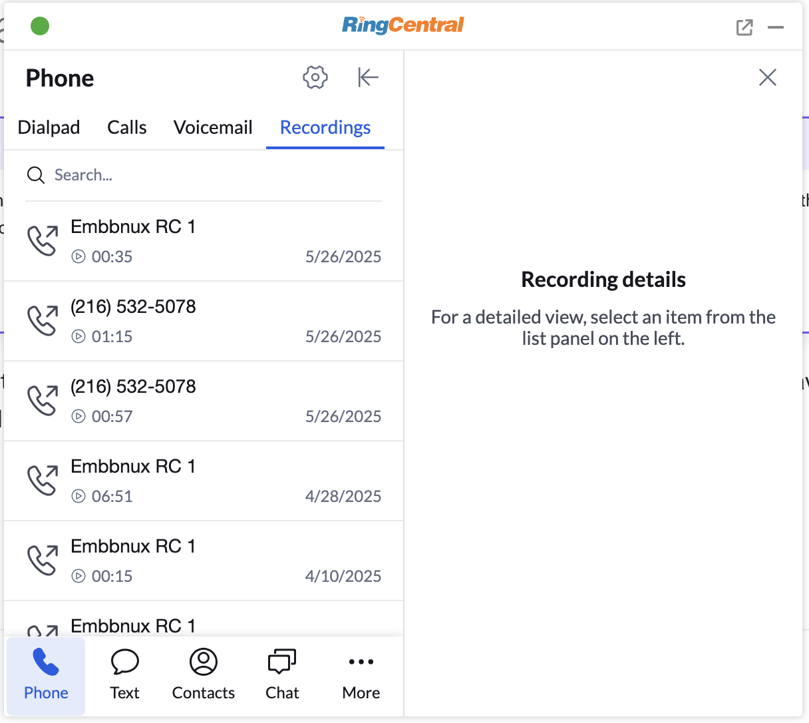

# RingCentral Embeddable 3.0 Beta

<!-- md:version 3.0.0 -->

RingCentral Embeddable 3.0 marks the next generation of this popular RingCentral product, allowing developers to easily embed a RingCentral phone, SMS client, and more into any webpage or web application. Version 3.0 delivers a significantly enhanced calling experience and modern UI architecture.

!!! success "100% Backwards Compatible"
    RingCentral Embeddable 3.0 is fully backwards compatible with 2.x applications. You can upgrade seamlessly without breaking changes.

!!! info "Beta Release"
    Version 3.0 is currently in BETA. We welcome feedback and suggestions for improvements.

## What's new in 3.0

### Enhanced UI with Side Panel

{class="float-end" style="max-width: 400px" align="right"}

The most significant improvement in 3.0 is the **side panel architecture**. This new design allows users to access detailed information without leaving the main list view, creating a more fluid and efficient user experience.

**Supported detail pages:**

- :material-phone: **Call recording page** - Access and manage call recordings
- :material-voicemail: **Voicemail details page** - Listen to and manage voicemails
- :material-message: **SMS conversation page** - View full message threads
- :material-fax: **Fax details page** - Review sent and received faxes
- :material-account: **Contact details page** - Complete contact information
- :material-chat: **Chat conversation page** - Team messaging conversations
- :material-phone-log: **Log call page** - Call logging and notes
- :material-message-text: **Log messages page** - Message logging interface

### Call Widgets

Call Widgets represent a powerful new capability that allows developers to inject dynamic, contextual content directly into the calling experience.

{style="max-width: 600px"}

**Key features:**

- **Contextual integration** - Widgets appear automatically during active calls
- **Dynamic content** - Display CRM data, support cases, or any custom information
- **Real-time updates** - Content updates based on call context and user interactions
- **Flexible UI** - Built on JSON Schema for maximum customization

!!! tip "Learn more about Call Widgets"
    Get comprehensive details about implementing call widgets in the [call widget documentation](./integration/call-widget.md).

## Voicemail Drop (Beta)

Voicemail Drop allows users to automatically leave a pre-recorded message when an outbound call reaches voicemail.

!!! info "This means users don’t have to wait for the voicemail recording to finish — they can immediately start the next call instead."

Follow this [guide](./config/voicemail-drop.md) to enable the feature.

## Heads-Up Display (HUD) Beta

Bringing the popular HUD functionality from our desktop application to Embeddable, users can now monitor team member presence, see which calls are parked or queued, and pick up those calls directly. It’s real-time call management right where you work.

Supported types:

1. Extensions - monitor team member presence

2. Park locations - park and pick up calls from specific [park locations](https://support.ringcentral.com/article-v2/Managing-park-locations-in-the-Admin-Portal.html?brand=RingCentral&product=RingEX&language=en_US)

3. Group call pick up - pick up calls from [group call pickup](https://support.ringcentral.com/article-v2/Setting-up-Group-Call-Pickup-group.html?brand=RC_US&product=RingEX&language=en_US)

4. Call queue pick up - pick up queued calls when primary agents are busy in [call queue](https://support.ringcentral.com/article-v2/Set-up-Call-Queue-Pickup-Group.html?brand=RC_US&product=RingEX&language=en_US)

!!! tip "Enable HUD"
    The feature is currently in BETA. Users needs to enable in "Settings -> Advanced -> HUD" firstly.

## New multiple tabs support solution

The Web Phone module now supports multiple browser tabs using a Shared Worker.
This improvement enables:

* **Seamless operation across tabs** – The phone connection stays active even if users open or switch between multiple tabs.

* **Better performance** – Reduces redundant resource usage by sharing a single worker across tabs.

* **Improved stability** – Prevents conflicts and disconnections caused by multiple independent connections.

## Getting started with 3.0

### Quick setup

Update your application to use the 3.x build:

=== "Javascript"

    Add the following code to your website's header to embed RingCentral Embeddable 3.0:

    ```js
    <script>
      (function() {
        var rcs = document.createElement("script");
        rcs.src = "https://apps.ringcentral.com/integration/ringcentral-embeddable/3.x/adapter.js?clientId=YOUR_RINGCENTRAL_CLIENT_ID&enableSideWidget=1"; // (1)!
        var rcs0 = document.getElementsByTagName("script")[0];
        rcs0.parentNode.insertBefore(rcs, rcs0);
      })();
    </script>
    ```

    1. Replace `YOUR_RINGCENTRAL_CLIENT_ID` with your actual RingCentral application client ID

=== "iframe"

    Add the following iframe anywhere on your webpage:

    ```html
    <iframe 
      width="300" 
      height="500" 
      allow="microphone" 
      src="https://apps.ringcentral.com/integration/ringcentral-embeddable/3.x/app.html?clientId=YOUR_RINGCENTRAL_CLIENT_ID&enableSideWidget=1">
    </iframe>
    ```

### Required configuration

Add the following redirect URI to your RingCentral application settings in the [Developer Console](https://developers.ringcentral.com/):

```
https://apps.ringcentral.com/integration/ringcentral-embeddable/3.x/redirect.html
```

!!! warning "Important"
    The redirect URI must be added to your RingCentral application configuration, or authentication will fail.

## Migration from 2.x

### Seamless upgrade

Migrating from 2.x to 3.0 is straightforward:

1. **Update the URL** - Change `latest` or `2.x` to `3.x` in your script src
2. **Add enableSideWidget** - Include `enableSideWidget=1` to access new features
3. **Update redirect URI** - Add the 3.x redirect URI to your app settings
4. **Test thoroughly** - Verify all existing functionality works as expected

## Next steps

Ready to get started with RingCentral Embeddable 3.0?

[Online demo](https://apps.ringcentral.com/integration/ringcentral-embeddable/3.x/index.html){ .md-button .md-button--primary }
[Call widgets docs](./integration/call-widget.md){ .md-button }
