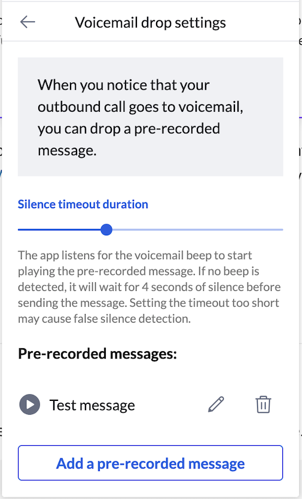
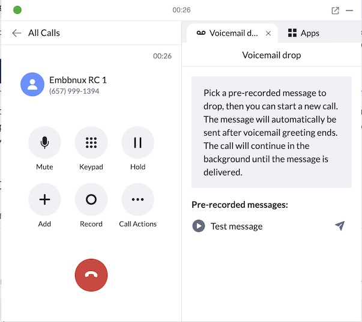

# Voicemail Drop (Beta)

<!-- md:version 3.0.0 -->

Voicemail Drop allows users to automatically leave a pre-recorded message when an outbound call reaches voicemail.

This means users don’t have to wait for the voicemail recording to finish — they can immediately start the next call instead.

## Enable Voicemail Drop

To enable Voicemail Drop, you need to set `enableVoicemailDrop` and `enableSideWidget` flag into the widget's URI.

=== "Javascript"

    ```js
    <script>
      (function() {
        var rcs = document.createElement("script");
        rcs.src = "https://apps.ringcentral.com/integration/ringcentral-embeddable/3.x/adapter.js?enableSideWidget=1&enableVoicemailDrop=1";
        var rcs0 = document.getElementsByTagName("script")[0];
        rcs0.parentNode.insertBefore(rcs, rcs0);
      })();
    </script>
    ```

=== "iframe"

    ```html
    <iframe width="300" height="500" id="rc-widget" allow="microphone" 
      src="https://apps.ringcentral.com/integration/ringcentral-embeddable/3.x/app.html?enableSideWidget=1&enableVoicemailDrop=1">
    </iframe>
    ```

After enabled, user can get voicemail drop settings in "Settings > Advanced -> Voicemail drop" page.



After pre-recorded messages added, user will get voicemail drop button in call actions. User can select one of the pre-recorded messages to leave.



## Online demo

[Voicemail drop online demo](https://apps.ringcentral.com/integration/ringcentral-embeddable/3.x/index.html){ .md-button .md-button--primary }