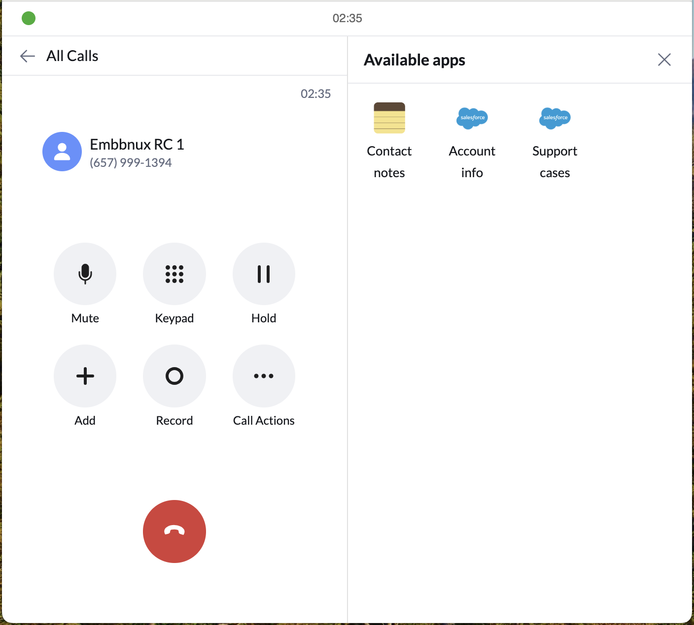
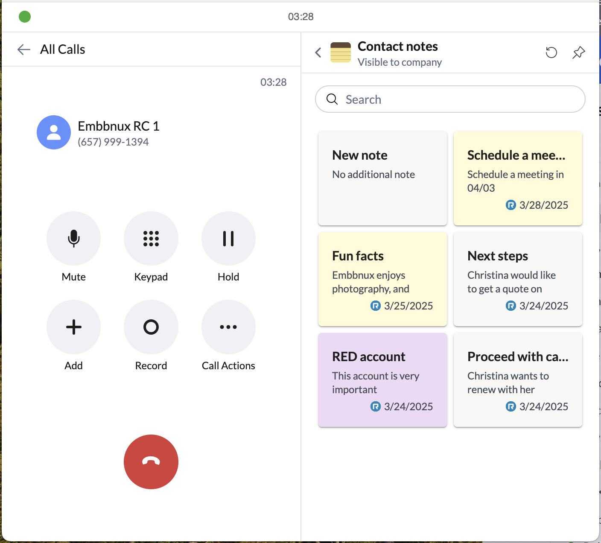

# Call widgets

<!-- md:version 3.0.0 -->

Call Widgets are a powerful capability of RingCentral Embeddable, allowing developers to inject dynamic, contextual content directly into the core RingCentral calling experience.

When a user is on a call, call widgets appear in the right-hand panel, enabling quick access to relevant information or actions—without leaving the call page.


## Getting started

### Enable side widget feature

Before registering a widget, you must first enable the side widget feature:

=== "Javascript"

    ```js
    <script>
      (function() {
        var rcs = document.createElement("script");
        rcs.src = "https://apps.ringcentral.com/integration/ringcentral-embeddable/latest/adapter.js?enableSideWidget=1";
        var rcs0 = document.getElementsByTagName("script")[0];
        rcs0.parentNode.insertBefore(rcs, rcs0);
      })();
    </script>
    ```

The `enableSideWidget=1` parameter is required to activate call widget functionality

### Register a call widget

Once enabled, register your custom call widget:

```js
document.querySelector("#rc-widget-adapter-frame").contentWindow.postMessage({
    type: 'rc-adapter-register-widget-app',
    app: {
      id: 'support-cases',
      name: 'Support cases',
      iconUri: 'https://example.com/icon.png',
      pagePath: '/sidebarApps/support-cases',
      inputChangedPath: '/sidebarApps/support-cases/inputChanged',
      buttonEventPath: '/sidebarApps/support-cases/button-click',
    },
  }, '*')
```

1. Unique identifier for your widget
2. Display name shown in the widget menu
3. Icon URL (128x128px recommended)
4. Main content request path
5. Input change event path
6. Button click event path

!!! tip "Multiple widgets"
    You can register multiple call widgets by calling the registration API multiple times with different configurations.

After successful registration, your call widget will appear during active calls:



## Building widget content

### Understanding the request flow

When a user opens your call widget, the Embeddable framework sends a message to your app requesting page data in JSON format. The widget page is rendered using the [JSON Schema Form library](https://rjsf-team.github.io/react-jsonschema-form), allowing for dynamic and customizable UI layouts.

!!! note "JSON Schema reference"
    Learn how to define custom widget pages with JSON schema in the [JSON schema page document](https://ringcentral.github.io/ringcentral-embeddable/jsonschema-page/?path=/docs/readme--docs).

### Basic page response

Add an event listener to handle page data requests:

```js
function responseMessage(request, response) {
  document.querySelector("#rc-widget-adapter-frame").contentWindow.postMessage({
    type: 'rc-post-message-response',
    responseId: request.requestId,
    response,
  }, '*');
}

function getCasesPageJSON(cases) {
  return {
    page: {
      type: 'json-schema',
      schema: {
        type: 'object',
        required: [],
        properties: {
          "title": {
            "type": "string",
            "description": "All open cases",
          },
          "description": {
            "type": "string",
            "description": "1 item, Updated at 06/13/2025",
          },
          "caseSearch": {
            "type": "string",
            "description": "Search cases",
          },
          "caseList": {
            "type": "string",
            "oneOf": cases.map((item) => ({
              const: item.link,
              title: item.CaseNumber,
              description: item.Subject,
              authorName: item.Contact ? item.Contact.Name : null,
              meta: item.Status,
            })),
          },
          "accountId": {
            "type": "string",
            "description": "Account ID",
          },
        },
      },
      uiSchema: {
        title: {
          "ui:field": "typography",
          "ui:variant": "body2",
        },
        description: {
          "ui:field": "typography",
          "ui:variant": "caption1",
          "ui:style": { marginTop: '-20px' },
        },
        caseSearch: {
          "ui:field": "search",
          "ui:placeholder": 'Search this list',
          "ui:label": false,
          "ui:style": { marginTop: '-10px' },
        },
        caseList: {
          "ui:field": "list",
          "ui:showSelected": false,
          "ui:label": false,
        },
        accountId: {
          "ui:widget": "hidden",
        },
      },
      formData: {
        caseSearch: '',
        accountId: 'hidden_account_id',
      },
    },
    actions: [{
      id: 'home',
      label: 'Home',
    }, {
      id: 'unauthorize',
      label: 'Unauthorize CRM',
      color: 'danger.b04',
    }],
  };
}

window.addEventListener('message', function (e) {
  var data = e.data;
  if (data && data.type === 'rc-post-message-request') {
    if (data.path === '/sidebarApps/support-cases') {
      const contact = data.body.contact; // get contact { phoneNumber } from call
      // TODO: get cases from your CRM with contact info
      const cases = [{
        link: 'https://case_link',
        CaseNumber: '666666',
        Subject: 'Customer want to buy a car',
        Contact: {
          name: 'Customer Name',
        },
        Status: 'New',
      }];
      responseMessage(data, {
        data: getCasesPageJSON(cases),
      });
    }
  }
});
```

1. Dynamic list generation from your data
2. UI Schema controls the visual presentation
3. Form data sets initial values
4. Actions create menu buttons
5. Contact information from the active call


## Handling user interactions

### Search functionality

Implement search with debouncing to optimize API calls:

```js
// We use debounce to avoid sending too many requests to your CRM
let supportCasesSearchDebounce = null;

function debounceSupportCasesSearch(request) {
  if (!supportCasesSearchDebounce) {
    supportCasesSearchDebounce = {};
  } else {
    const timeout = supportCasesSearchDebounce.timeout;
    clearTimeout(timeout);
    const preRequest = supportCasesSearchDebounce.request;
    if (preRequest) {
      // respond 'ok' to avoid re-render the page
      responseMessage(preRequest, {
        data: 'ok',
      });
    }
  }
  supportCasesSearchDebounce.request = request;
  supportCasesSearchDebounce.timeout = setTimeout(async () => {
    supportCasesSearchDebounce = null;
    const contact = request.body.contact;
    const search = request.body.formData.caseSearch;
    const accountId = request.body.formData.accountId;
    // TODO: get cases from your CRM
    const cases = [{
      link: 'https://case_link',
      CaseNumber: '666666',
      Subject: 'Customer want to buy a car',
      Contact: {
        name: 'Customer Name',
      },
      Status: 'New',
    }];
    responseMessage(request, {
      data: getCasesPageJSON(cases),
    });
  }, 800);
}

window.addEventListener('message', function (e) {
  var data = e.data;
  if (data && data.type === 'rc-post-message-request') {
    if (data.path === '/sidebarApps/support-cases') {
      // Handle main page request
    }
    if (data.path === '/sidebarApps/support-cases/inputChanged') {
      if (data.body.changedKeys[0] === 'caseSearch') {
        debounceSupportCasesSearch(data);
      }
    }
  }
});
```

1. 800ms debounce delay to prevent excessive API calls

### Item selection handling

Handle user interactions with list items:

```js
window.addEventListener('message', function (e) {
  var data = e.data;
  if (data && data.type === 'rc-post-message-request') {
    // ...
    if (data.path === '/sidebarApps/support-cases/inputChanged') {
      // ...
      if (data.body.changedKeys[0] === 'caseList') {
        const caseLink = data.body.formData.caseList;
        // Open case detail page in new tab
        window.open(caseLink, '_blank');
        responseMessage(data, {
          data: 'ok',
        });
      }
    }
  }
});
```

## Authentication flow

### Authorization page

For widgets requiring authentication, implement an authorization flow:


```js
let crmAuthorized = false; // Set to true when user authorizes your CRM

function getAuthorizationPageJSON() {
  return {
    page: {
      type: 'json-schema',
      schema: {
        type: 'object',
        required: [],
        properties: {
          "crmAuthButton": {
            "type": "string",
            "title": "Authorize CRM",
          },
        },
      },
      uiSchema: {
        "crmAuthButton": {
          "ui:field": "button",
          "ui:variant": "contained", // "text", "outlined", "contained", "plain"
          "ui:fullWidth": true
        },
      },
      formData: {},
    },
  };
}

function getRefreshAuthorizationJson() {
  return {
    page: {
      type: 'json-schema',
      schema: {
        type: 'object',
        required: [],
        properties: {
          "someMessage": {
            "type": "string",
            "description": "Refresh the app after authorization",
          },
        },
      },
      uiSchema: {
        someMessage: {
          "ui:field": "admonition",
          "ui:severity": "info",
        },
      },
      formData: {},
    },
  };
}
```

### Authorization handling

```js
window.addEventListener('message', function (e) {
  var data = e.data;
  if (data && data.type === 'rc-post-message-request') {
    if (data.path === '/sidebarApps/support-cases') {
      if (!crmAuthorized) {
        // Show authorization page
        responseMessage(data, {
          data: getAuthorizationPageJSON(),
        });
        return;
      }
      // Show main content when authorized
    }
    if (data.path === '/sidebarApps/support-cases/button-click') {
      if (data.body.button.id === 'crmAuthButton') {
        // Open authorization page in new tab
        window.open('https://crm-authorization-page', '_blank');
        responseMessage(data, {
          data: getRefreshAuthorizationJson(),
        });
      }
    }
  }
});
```

!!! warning "Post-authorization flow"
    After user authorization, the app needs to be refreshed to load the authenticated data. The widget will display a refresh message to guide users through this process.

## Action buttons

Actions are buttons that appear in the call widget's more actions menu:


```js
window.addEventListener('message', function (e) {
  var data = e.data;
  if (data && data.type === 'rc-post-message-request') {
    if (data.path === '/sidebarApps/support-cases/button-click') {
      if (data.body.button.id === 'home') {
        // Navigate to home page
        responseMessage(data, {
          data: getCasesPageJSON(cases),
        });
      }
      if (data.body.button.id === 'unauthorize') {
        // Revoke authorization
        crmAuthorized = false;
        responseMessage(data, {
          data: getAuthorizationPageJSON(),
        });
      }
    }
  }
});
```

## Example implementation

### Contact notes widget

Here is an online demo of a contact notes widget:

[Contact notes widget online demo](https://apps.ringcentral.com/integration/ringcentral-embeddable/3.x/index.html){ .md-button .md-button--primary }



!!! example "Complete implementation"
    Get the full source code for the contact notes widget in the [GitHub repository](https://github.com/ringcentral/ringcentral-embeddable-contact-notes-widget/).
