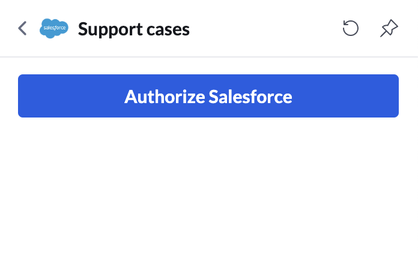

# Call widgets

<!-- md:version 3.0.0 -->

Call Widgets are a new capability of RingCentral Embeddable, allowing developers to inject dynamic, contextual content directly into the core RingCentral calling experience.

When a user is on a call, call widgets appear in the right-hand panel, enabling quick access to relevant information or actions—without leaving the call page.


## Registering a call widget

Before registering a widget, you must first enable the side widget feature:

=== "Javascript"

    ```js
    <script>
      (function() {
        var rcs = document.createElement("script");
        rcs.src = "https://apps.ringcentral.com/integration/ringcentral-embeddable/latest/adapter.js?enableSideWidget=1";
        var rcs0 = document.getElementsByTagName("script")[0];
        rcs0.parentNode.insertBefore(rcs, rcs0);
      })();
    </script>
    ```

Once enabled, register your custom call widget:

```js
document.querySelector("#rc-widget-adapter-frame").contentWindow.postMessage({
    type: 'rc-adapter-register-widget-app',
    app: {
      id: 'support-cases',
      name: 'Support cases',
      iconUri: 'https://icon_uri',
      pagePath: '/sidebarApps/support-cases',
      inputChangedPath: '/sidebarApps/support-cases/inputChanged',
      buttonEventPath: '/sidebarApps/support-cases/button-click',
    },
  }, '*')
```

You can register multiple call widgets by calling the "register" API multiple times with different configurations..

After successful registration, your call widget will appear during active calls:


## Responding to call widget requests

When a user opens your call widget, the Embeddable framework sends a message to your app requesting page data in JSON format.

The widget page is rendered using [JSON schema form library](https://rjsf-team.github.io/react-jsonschema-form) , allowing for a dynamic and customizable UI layout.

Learn how to define custom widget pages with JSON schema in the [customized tab document](./custom-tab.md).

Add a event to response page data request:

```js
function responseMessage(request, response) {
  document.querySelector("#rc-widget-adapter-frame").contentWindow.postMessage({
    type: 'rc-post-message-response',
    responseId: request.requestId,
    response,
  }, '*');
}

function getCasesPageJSON(cases) {
  return {
    page: {
      type: 'json-schema',
      schema: {
        type: 'object',
        required: [],
        properties: {
          "title": {
            "type": "string",
            "description": "All open cases",
          },
          "description": {
            "type": "string",
            "description": "1 item, Updated at 06/13/2025",
          },
          "caseSearch": {
            "type": "string",
            "description": "Search cases",
          },
          "caseList": {
            "type": "string",
            "oneOf": cases.map((item) => ({
              const: item.link,
              title: item.CaseNumber,
              description: item.Subject,
              authorName: item.Contact ? item.Contact.Name : null,
              meta: item.Status,
            })),
          },
          "accountId": {
            "type": "string",
            "description": "Account ID",
          },
        },
      },
      uiSchema: {
        title: {
          "ui:field": "typography",
          "ui:variant": "body2",
        },
        description: {
          "ui:field": "typography",
          "ui:variant": "caption1",
          "ui:style": { marginTop: '-20px' },
        },
        caseSearch: {
          "ui:field": "search",
          "ui:placeholder": 'Search this list',
          "ui:label": false,
          "ui:style": { marginTop: '-10px' },
        },
        caseList: {
          "ui:field": "list",
          "ui:showSelected": false,
          "ui:label": false,
        },
        accountId: {
          "ui:widget": "hidden",
        },
      },
      formData: {
        caseSearch: '',
        accountId: 'hidden_account_id',
      },
    },
    actions: [{
      id: 'home',
      label: 'Home',
    }, {
      id: 'unauthorize',
      label: 'Unauthorize CRM',
      color: 'danger.b04',
    }],
  };
}

window.addEventListener('message', function (e) {
  var data = e.data;
  if (data && data.type === 'rc-post-message-request') {
    if (data.path === '/sidebarApps/support-cases') {
      const contact = request.body.contact; // get contact { phoneNumber } from call
      // TODO: get cases from your CRM with contact info
      const cases = [{
        link: 'https://case_link',
        CaseNumber: '666666',
        Subject: 'Customer want to buy a car',
        Contact: {
          name: 'Customer Name',
        },
        Status: 'New',
      }];
      responseMessage(request, {
        data: getCasesPageJSON(cases),
      });
    }
  }
});
```


Response to search input changes:

```js
// We use debounce to avoid sending too many requests to your CRM
let supportCasesSearchDebounce = null;
function debounceSupportCasesSearch(request) {
  if (!supportCasesSearchDebounce) {
    supportCasesSearchDebounce = {};
  } else {
    const timeout = supportCasesSearchDebounce.timeout;
    clearTimeout(timeout);
    const preRequest = supportCasesSearchDebounce.request;
    if (preRequest) {
      // respond 'ok' to avoid re-render the page
      responseMessage(preRequest, {
        data: 'ok',
      });
    }
  }
  supportCasesSearchDebounce.request = request;
  supportCasesSearchDebounce.timeout = setTimeout(async () => {
    supportCasesSearchDebounce = null;
    const contact = request.body.contact;
    const search = request.body.formData.caseSearch;
    const accountId = request.body.formData.accountId;
    // TODO: get cases from your CRM
    const cases = [{
      link: 'https://case_link',
      CaseNumber: '666666',
      Subject: 'Customer want to buy a car',
      Contact: {
        name: 'Customer Name',
      },
      Status: 'New',
    }];
    responseMessage(request, {
      data: getCasesPageJSON(cases),
    });
  }, 800);
}

window.addEventListener('message', function (e) {
  var data = e.data;
  if (data && data.type === 'rc-post-message-request') {
    if (data.path === '/sidebarApps/support-cases') {
      // ...
    }
    if (data.path === '/sidebarApps/support-cases/inputChanged') {
      if (data.body.changedKeys[0] === 'caseSearch') {
        debounceSupportCasesSearch(data);
      }
    }
  }
});
```

Respond to case item selection:

```js
window.addEventListener('message', function (e) {
  var data = e.data;
  if (data && data.type === 'rc-post-message-request') {
    if (data.path === '/sidebarApps/support-cases') {
      // ...
    }
    if (data.path === '/sidebarApps/support-cases/inputChanged') {
      // ...
      if (data.body.changedKeys[0] === 'caseList') {
        const caseLink = data.body.formData.caseList;
        // open case detail page in new tab
        window.open(caseLink, '_blank');
        responseMessage(request, {
          data: 'ok',
        });
      }
    }
  }
});
```

## Build authorization flow

For some widgets, you may need to build authorization flow to get the data.



```js
let crmAuthorized = false; // set to true when user authorize your CRM
function getAuthorizationPageJSON() {
  return {
    page: {
      type: 'json-schema',
      schema: {
        type: 'object',
        required: [],
        properties: {
          "crmAuthButton": {
            "type": "string",
            "title": "Authorize CRM",
          },
        },
      },
      uiSchema: {
        "crmAuthButton": {
          "ui:field": "button",
          "ui:variant": "contained", // "text", "outlined", "contained", "plain"
          "ui:fullWidth": true
        },
      },
      formData: {},
    },
  };
};
function getRefreshAuthorizationJson() {
  return {
    page: {
      type: 'json-schema',
      schema: {
        type: 'object',
        required: [],
        properties: {
          "someMessage": {
            "type": "string",
            "description": "Refresh the app after authorization",
          },
        },
      },
      uiSchema: {
        someMessage: {
          "ui:field": "admonition",
          "ui:severity": "info",
        },
      },
      formData: {},
    },
  };
}

window.addEventListener('message', function (e) {
  var data = e.data;
  if (data && data.type === 'rc-post-message-request') {
    if (data.path === '/sidebarApps/support-cases') {
      if (!crmAuthorized) {
        // show authorization page
        responseMessage(request, {
          data: getAuthorizationPageJSON(),
        });
        return;
      }
    }
    if (data.path === '/sidebarApps/support-cases/button-click') {
      if (data.body.button.id === 'crmAuthButton') {
        // open authorization page in new tab
        window.open('https://crm-authorization-page', '_blank');
        responseMessage(request, {
          data: getRefreshAuthorizationJson(),
        });
      }
    }
  }
});
```

For the flow, after user authorize your CRM, user need to refresh the app to get the data.

## Response action button click

In previous example, we also set actions in the page JSON. Actions are buttons that appear in call widget's more actions menu.


```js
window.addEventListener('message', function (e) {
  var data = e.data;
  if (data && data.type === 'rc-post-message-request') {
    // ...
    if (data.path === '/sidebarApps/support-cases/button-click') {
      //...
      if (data.body.button.id === 'home') {
        // open home page
        responseMessage(request, {
          data: getCasesPageJSON(cases),
        });
      }
      if (data.body.button.id === 'unauthorize') {
        // unauthorize your CRM
        crmAuthorized = false;
        responseMessage(request, {
          data: getAuthorizationPageJSON(),
        });
      }
    }
  }
});
```

## Contact notes widget

Here is a online demo of contact notes widget:

[Contact notes widget online demo](https://apps.ringcentral.com/integration/ringcentral-embeddable/3.x/index.html)


Get full code about contact notes widget in [this repo](https://github.com/ringcentral/ringcentral-embeddable-contact-notes-widget/).