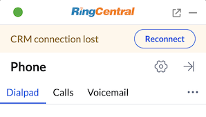

# Custom banner

<!-- md:version 3.0.0 -->

RingCentral Embeddable allows you to display a customized banner at the top of the widget to show status messages and action buttons. This is useful for displaying alerts, errors, or notifications that require user attention.

## Register a banner with service

You can register a banner when registering your third-party service:

```js
document.querySelector("#rc-widget-adapter-frame").contentWindow.postMessage({
  type: 'rc-adapter-register-third-party-service',
  service: {
    name: 'TestService',
    buttonEventPath: '/button-click', // required for handling banner action events
    banner: {
      id: 'my-banner',
      message: 'CRM connection lost',
      severity: 'warning',  // 'info' | 'warning' | 'error' | 'success', default: 'info'
      action: {  // optional, show action button
        label: 'Reconnect' // action button label, required
      },
      closable: true // optional, show close button, default: false, only works if no action button is provided
    }
  }
}, '*');
```

## Update or show a banner

To display or update a customized banner:

```js
document.querySelector("#rc-widget-adapter-frame").contentWindow.postMessage({
  type: 'rc-adapter-update-customized-banner',
  banner: {
    id: 'my-banner', // banner id, required
    message: 'CRM connection lost', // banner message, required
    severity: 'warning', // 'info' | 'warning' | 'error' | 'success', default: 'info'
    action: { // optional, show action button
      label: 'Reconnect' // action button label, required
    },
    closable: true // optional, show close button, default: false, only works if no action button is provided
  }
}, '*');
```



### Banner options

| Property | Type | Required | Default | Description |
|----------|------|----------|---------|-------------|
| `id` | string | Yes | - | Unique identifier for the banner |
| `message` | string | Yes | - | The message to display in the banner |
| `severity` | string | No | `'info'` | Banner type: `'info'`, `'warning'`, `'error'`, or `'success'` |
| `action` | object | No | - | Action button configuration |
| `action.label` | string | Yes (if action provided) | - | Label for the action button |
| `action.variant` | string | No | `'outlined'` | Button variant: `'text'`, `'outlined'`, `'contained'`, or `'plain'` |
| `action.color` | string | No | - | Button color, e.g., `'danger.b04'`, `'success.b04'`, `'primary'` |
| `closable` | boolean | No | `false` | Whether to show a close button |

### Severity types

- `info` - Blue banner for informational messages
- `warning` - Yellow/orange banner for warnings
- `error` - Red banner for errors
- `success` - Green banner for success messages

## Update a banner

To update an existing banner, send the same message with updated properties:

```js
document.querySelector("#rc-widget-adapter-frame").contentWindow.postMessage({
  type: 'rc-adapter-update-customized-banner',
  banner: {
    id: 'my-banner',
    message: 'Updated message',
    severity: 'warning'
  }
}, '*');
```

## Remove a banner

To remove the banner, set `hidden` to `true` with the banner `id`:

```js
document.querySelector("#rc-widget-adapter-frame").contentWindow.postMessage({
  type: 'rc-adapter-update-customized-banner',
  banner: {
    id: 'my-banner',
    hidden: true
  }
}, '*');
```

## Handle action button click and close events

To handle banner action button clicks and close events, you need to register `buttonEventPath` when registering your service:

```js
document.querySelector("#rc-widget-adapter-frame").contentWindow.postMessage({
  type: 'rc-adapter-register-third-party-service',
  service: {
    name: 'TestService',
    buttonEventPath: '/button-click',
  }
}, '*');
```

Then add an event listener to handle the button events:

```js
window.addEventListener('message', function (e) {
  var data = e.data;
  if (data && data.type === 'rc-post-message-request') {
    if (data.path === '/button-click') {
      var button = data.body.button;
      
      // Check if this is a banner event
      if (button.type === 'customizedBanner') {
        if (button.dismissed) {
          // User clicked the close button
          console.log('Banner dismissed:', button.id);
        } else {
          // User clicked the action button
          console.log('Banner action clicked:', button.id, button.label);
          // Handle the action (e.g., stop recording)
        }
      }
      
      // Send response
      document.querySelector("#rc-widget-adapter-frame").contentWindow.postMessage({
        type: 'rc-post-message-response',
        responseId: data.requestId,
        response: { data: 'ok' },
      }, '*');
    }
  }
});
```

### Button event data

When the user clicks the action button:

```js
{
  button: {
    id: 'my-banner', // banner id
    type: 'customizedBanner',
    label: 'Stop Recording' // action button label
  }
}
```

When the user clicks the close button:

```js
{
  button: {
    id: 'my-banner', // banner id
    type: 'customizedBanner',
    dismissed: true
  }
}
```

## Example: Recording error banner

Here's a complete example showing a recording error banner with a stop action:

```js
// Register service with button event path and initial banner
document.querySelector("#rc-widget-adapter-frame").contentWindow.postMessage({
  type: 'rc-adapter-register-third-party-service',
  service: {
    name: 'MyApp',
    buttonEventPath: '/button-click',
    banner: {
      id: 'recording-error',
      message: 'Recording failed. Please try again.',
      severity: 'error',
      action: {
        label: 'Stop Recording',
        variant: 'contained',
        color: 'danger.b04'
      },
    }
  }
}, '*');

// Handle button events
window.addEventListener('message', function (e) {
  var data = e.data;
  if (data && data.type === 'rc-post-message-request') {
    if (data.path === '/button-click') {
      var button = data.body.button;
      
      if (button.type === 'customizedBanner' && button.id === 'recording-error') {
        if (button.dismissed) {
          console.log('User dismissed the recording error banner');
        } else {
          console.log('User clicked Stop Recording');
          // Stop the recording...
          
          // Remove the banner after handling
          document.querySelector("#rc-widget-adapter-frame").contentWindow.postMessage({
            type: 'rc-adapter-update-customized-banner',
            banner: {
              id: 'recording-error',
              hidden: true
            }
          }, '*');
        }
      }
      
      document.querySelector("#rc-widget-adapter-frame").contentWindow.postMessage({
        type: 'rc-post-message-response',
        responseId: data.requestId,
        response: { data: 'ok' },
      }, '*');
    }
  }
});
```

!!! note "Single banner"
    Only one customized banner can be displayed at a time. Registering a new banner will replace the existing one.

