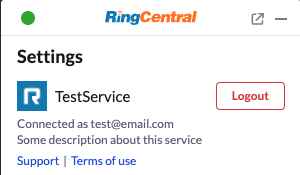

# Add third-party authorization button

For some CRM API, they requires user to authorize firstly. This feature allows developer to add a third party authorization button and sync status into widget.

First you need to pass `authorizationPath`, `authorizedTitle`, `unauthorizedTitle` and `authorized` when you register service.

```js
document.querySelector("#rc-widget-adapter-frame").contentWindow.postMessage({
  type: 'rc-adapter-register-third-party-service',
  service: {
    name: 'TestService',
    displayName: 'TestService', // Optional, supported from 2.0.1
    info: 'Some description about this service', // Optional, supported from 2.0.0
    authorizationPath: '/authorize',
    authorizedTitle: 'Logout', // authorized button title in authorization section.
    unauthorizedTitle: 'Connect', // unauthorized button title in authorization section.
    authorized: false,
    authorizedAccount: 'test@email.com', // optional, authorized account email or id
    authorizationLogo: 'https://your_brand_picture/logo.png', // optional, show your brand logo in authorization section, recommended: height 30px, width < 85px.
    // showAuthRedDot: true, // optional, this will show red dot at settings page when need to auth
    // licenseStatus: 'License: expired', // optional, supported from 3.0.0. To show license status in authorization section.
    // licenseDescription: 'Please purchase license at [here](https://www.ringcentral.com/). To use this feature, you need to purchase a license.',
    authorizationLinks: [
      { label: 'Support', uri: 'https://www.ringcentral.com/contact' },
      { label: 'Terms of use', uri: 'https://www.ringcentral.com/terms' },
    ], // optional, supported from 3.0.0. To add more links to authorization section.
  }
}, '*');
```

After registered, you can get a `TestService authorization button` in setting page:



Add a message event to response authorization button event:

```js
window.addEventListener('message', function (e) {
  var data = e.data;
  if (data && data.type === 'rc-post-message-request') {
    if (data.path === '/authorize') {
      // add your codes here to handle third party authorization
      console.log(data);
      // response to widget
      document.querySelector("#rc-widget-adapter-frame").contentWindow.postMessage({
        type: 'rc-post-message-response',
        responseId: data.requestId,
        response: { data: 'ok' },
      }, '*');
    }
  }
});
```

Update authorization status in widget:

```js
document.querySelector("#rc-widget-adapter-frame").contentWindow.postMessage({
  type: 'rc-adapter-update-authorization-status',
  authorized: true,
  authorizedAccount: 'test@email.com', // optional, authorized account email or id
}, '*');
```

!!! info "If you register an authorization service into Embeddable, the contacts-related service above will work only after the user's status has changed to authorized."
